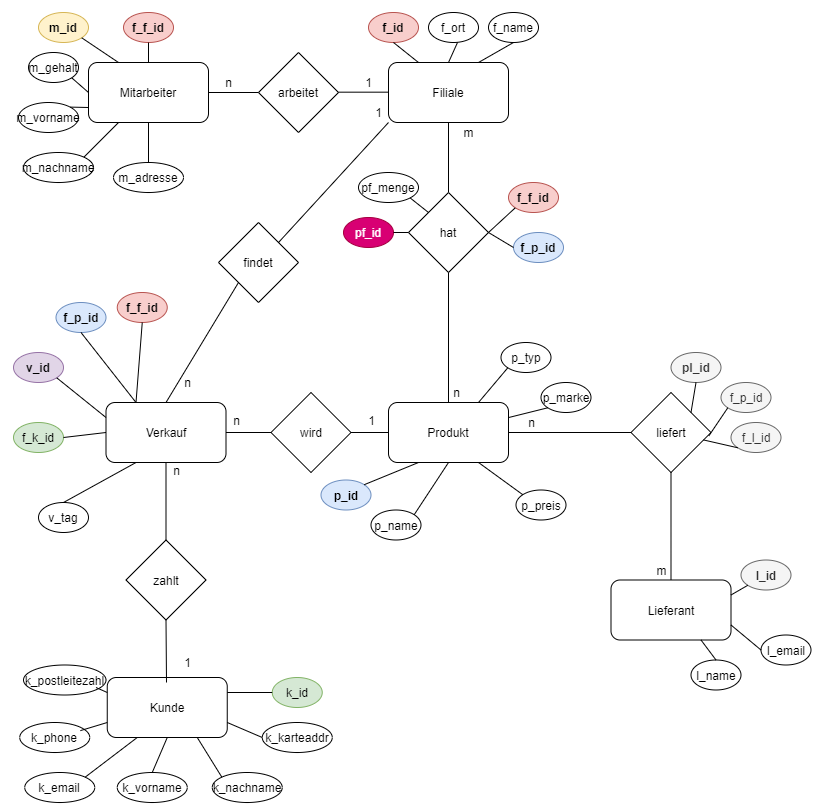

# Cikalleshi_SNMP
Informatik: Programmierung mit HTML, PHP, JavaScript, PDO und MySQL

## Introduction

Diese Website soll das Verwaltungssystem eines Supermarktes simulieren. Die Seite wurde mit HTML, PHP, JavaScript, PDO und MySQL programmiert.

## Features

Sie können auf dieser Seite ein Konto anlegen (sollte später für Kunden und den Online-Shop sein). Wenn Sie sich als Administrator anmelden, können Sie fast alles in einem Supermarkt verwalten, z. B. neue Produkte hinzufügen, prüfen, wie viele Produkte noch auf Lager sind, usw. Außerdem hat man ein Dashboard als Startseite. 

## Current Features
* Sig-in and Login
* Dashboard with Charts
* Managment 
  * Employee
  * Item
  * Stock
  * Sales
  * Client
* Edit and delete tables
* Change Password
* Log Out

## ER-Diagram

## Homepage

## Management

